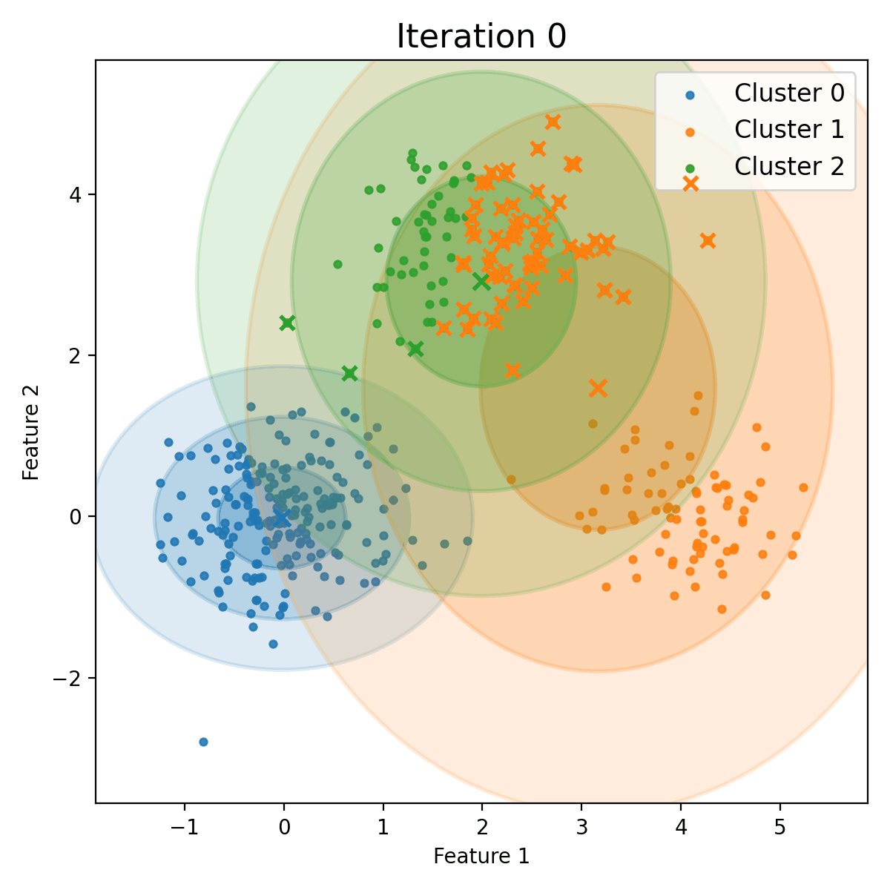
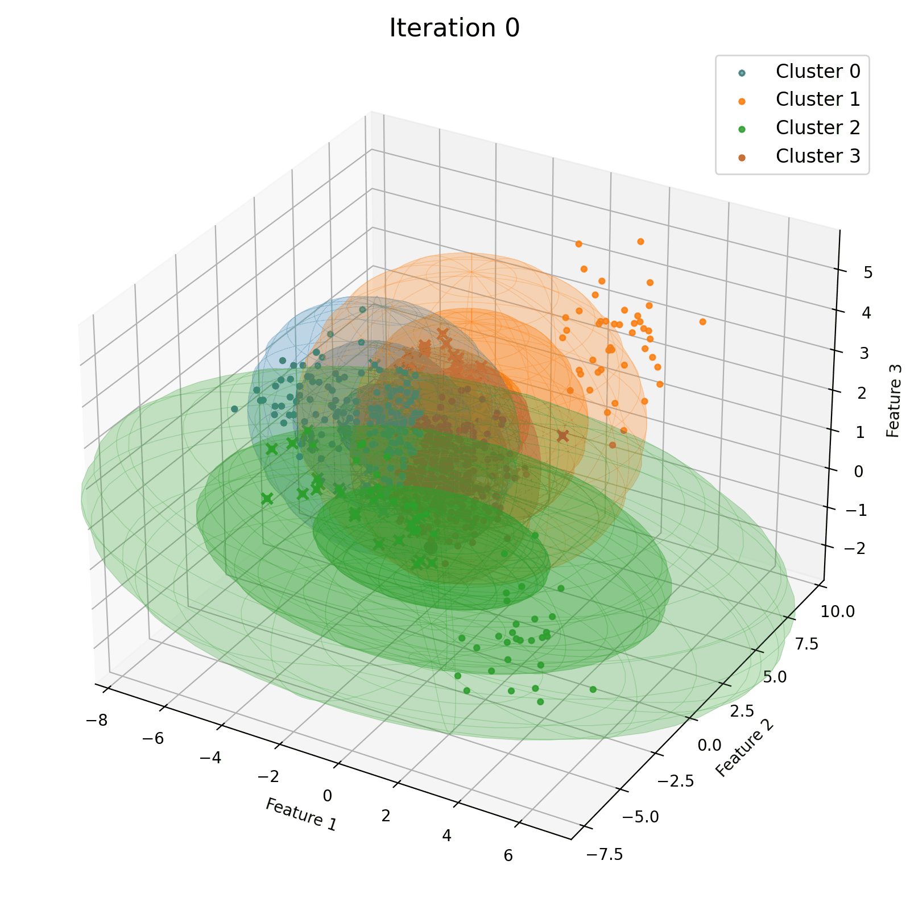

# Parallel-EM-Clustering

Implementation of **Expectation–Maximization** (EM) algorithm for clustering, using **MPI** for distributed processing. 

The project was developed as part of the course "High Performance Computing For Data Science (HPC4DS)", held by Prof. Sandro Luigi Fiore at the University of Trento, Master's Degree in Computer Science

[View Full Report (PDF)](report.pdf)

To review the implementation of the Hybrid approach, please switch to the dedicated **Hybrid** branch on the GitHub repository.

## Table of Contents

* [1. Repository Structure](#repository-contents)
* [2. Requirements](#requirements)
* [3. Program Execution](#program-execution)
    * [3.1 Compilation](#1-compilation)
    * [3.2 Generating the Input Data](#2-generating-the-input-data)
    * [3.3 Running the Program](#3-running-the-program)
        * [Available Parameters](#available-parameters)
        * [Batch Runs (Cluster)](#batch-runs-on-the-cluster-for-performance-experiments)
* [4. Outputs](#outputs)
    * [Visualize Clustering Process](#visualize-the-algorithms-clustering-process)
* [5. License & Authors](#license--authors)

---
## 1. Repository Contents
- **`src/`**: Directory containing the C source code for the EM clustering algorithm
  - **`headers/`**: Header files (data structures, function prototypes)
  - **`main.c`**: Entry point for the parallel (MPI and OpenMP) version
  - **`em_algorithm.c`**: Core EM algorithm implementation
  - **`mpi_utils.c`**: MPI communication utilities
  - **`io_utils.c`**: Input/output file operations
  - **`utils.c`**: General utility functions
  - **`debug.c`**: Debug logging functions (enabled with `-DDEBUG`)
  - **`sequential/multiFeature.c`**: Entry point for the sequential version

- **`tools/`**: Python utilities
  - **`dataGeneration/`**: Scripts for generating synthetic datasets
  - **`dataElaboration/`**: Scripts for visualizing and analyzing results

- **`scripts/`**: Shell scripts for automation
  - **`dataset_generator.sh`**: Batch dataset generation
  - **`multiple_job_generator.sh`**: Generate multiple cluster job scripts based on the configurations provided
  - **`launch_jobs.sh`**: Submit generated jobs to the cluster, respecting cluster limits
  - **`job_template.sh`**: Template for cluster job scripts
  - **`sequentialJob.sh`**: Single sequential job submission
  - **`singleParallelJob.sh`**: Single parallel job submission

- **`data/`**: Data storage (created during execution)
  - **`datasets/`**: Generated datasets (CSV + metadata)
  - **`algorithm_results/`**: Debug/intermediate outputs
  - **`elaborated/`**: Processed results and visualizations

- **`docs/`**: Documentation and media
  - **`media/`**: Images, GIFs, and animations
  - **`LaTeX/`**: LaTeX source for reports/papers

- **`bin/`**: Compiled executables (generated by `make`)

- **`Makefile`**: Build system for compiling all versions

- **`elaborate_data.ipynb`**: Jupyter notebook for data analysis and visualization

- **`report.pdf`**: Final report document

## 2. Requirements
  - MPI Compiler (mpicc):
      The core parallel functionality requires the Message Passing Interface (MPI). You must have an MPI implementation installed (like OpenMPI or MPICH) and the associated compiler wrapper (mpicc) available in your system's PATH.
  - OpenMP Support:
      For hybrid parallelization, ensure your C compiler supports OpenMP. NB: if openMP is not supported, the hybrid version will still compile, but without parallelization in the shared memory sections.
  - Python 3:
      The provided tools for data generation and visualization require Python 3.x. The additional packages needed can be installed via the provided `requirements.txt` file (See section [3.2. Generating the Input Data](#32-generating-the-input-data) for details).

## 3. Program Execution

### 3.1. Compilation

To build the project, a Makefile is provided:

```bash
make
```

The executable will be generated at `bin/EM_Clustering`.

#### Hybrid version
The hybrid parallelized version of the algorithm can be compiled using the Makefile:
```bash
make omp
```
The executable will be generated at `bin/EM_Clustering`

#### Serial version
The serial version of the algorithm can also be compiled using the Makefile:
```bash
make sequential
```
The executable will be generated at `bin/EM_Sequential`

#### Debug Mode
A debug mode compilation is provided, which includes additional logging for checking the correctness of the implementation.
This can be activated either by setting the environment variable `DDEBUG=1` or by adding the keyword `debug` to the other provided compilation commands.
For example, to compile the parallel version in debug mode:
```bash
make debug
```
or, for the hybrid version:
```bash
make omp-debug
```
or, for the serial version:
```bash
make sequential-debug
```

#### Compiling on the Cluster
If you are compiling the project on the cluster, remember to load the
required MPI module before running any `make` command:

``` bash
module load mpich-3.2
```
This ensures that the correct MPI compiler wrappers and libraries are
available during compilation.

---

### 3.2. Generating the Input Data
We provide a script for generating synthetic datasets tailored to the clustering problem addressed in this project, allowing you to test and evaluate the algorithm under different configurations

Before running the Python scripts on your personal machine, a virtual environment should be created with all the required dependencies, provided in the `requirements.txt` file.

```bash
python3 -m venv .venv
source .venv/bin/activate
pip install -r requirements.txt
```
This environment provides all the necessary libraries to run also the other Python scripts included in the repository.

#### Automatic dataset generation
The datasets used in our analysis can be generated using the provided script:
```bash
./scripts/dataset_generator.sh
```
This script automatically creates several datasets with different configurations (number of examples, features, and clusters).
Each generated dataset is stored under the `data/datasets` directory.

#### Import the Dataset to the Cluster

The generated files can be exported to the cluster via:

```bash
scp  -r data/datasets user@cluster:/path/to/destination
```

#### Manual dataset generation
It is also possible to manually generate a custom dataset using the provided Python script. To run it from the main directory of the repository:
```bash
python tools/dataGeneration/data-generator.py
```
An example of usage with custom parameters:
```bash
python tools/dataGeneration/data-generator.py --samples 5000 --features 2 --clusters 4 --means-list "-10,0 0,10 10,0 0,-10"
```

##### Parameters

The list of possible parameters for the script are:

- `--samples, -s` (**int**, default `1000`):  
  Number of data points (samples) to generate.

- `--features, -f` (**int**, default `2`):  
  Number of features (dimensions) for each data point.

- `--clusters, -k` (**int**, default `3`):  
  Number of clusters (Gaussian components) to generate.

- `--means` (**list of str**):
  List of cluster means. You can specify:
  - A single value per cluster (e.g. `--means=0,5 --means=10,15` for 2 clusters in 2D)
  - A list of means using `--means-list` (e.g. `--means-list "0,0 5,5 10,10"` for 3 clusters in 2D)
  Each cluster mean should have a number of elements equal to `--features`.

- `--std` (**list of float**, default `1.0`):  
  Standard deviation(s) for the clusters. You can specify:
  - A single value to use for all clusters, or  
  - One value per cluster (e.g. `--std 1.0 0.8 1.2`).

- `--equal_size, -equal` (**flag**, default `False`):  
  Generate clusters with equal sample sizes instead of random proportions.

- `--random_state, -r` (**int**, default `43`):  
  Random number generator seed for reproducibility.

- `--output, -o` (**str**, default `em_dataset.csv`):  
  Output CSV filename. Saved under the `data/` directory.

- `--metadata, -m` (**str**, default `em_metadata.txt`):  
  Metadata filename (also saved under the `data/` directory).

- `--plot` (**flag**):  
  Display a 2D scatter plot of the generated dataset (only works when `--features 2`).


---

### 3.3. Running the Program

#### Sequential Version

```bash
./bin/EM_sequential
```

Example usage:

```bash
./bin/EM_sequential -i data/raw/em_dataset.csv -m data/raw/em_metadata.txt
```

#### Parallel Version


```bash
mpirun -np <num_processes> ./bin/EM_Clustering
```
Example usage, with 4 processes:
```bash
mpirun -np 4 ./bin/EM_Clustering -i data/raw/em_dataset.csv -m data/raw/em_metadata.txt
```

#### Available Parameters

The list of possible parameters for the program is:

- `-i` (**string**):  
  Path to the dataset input file.

- `-m` (**string**):  
  Path to the metadata input file.

- `-b` (**string**, optional):  
  Path to the file where benchmarks for the current jobs are appended. Should only be used in cluster runs.

- `-o` (**string**, optional):  
  Path to the output file. The final clustering result will be written here.

- `-d` (**string**, optional):  
  Path to the debug file. If provided, at every iteration of the algorithm, a clustering will be executed. Intermediate results along with current parameters are exported to this file.

- `-t` (**double**, optional):  
  Threshold value used for early stopping the algorithm. If set, the algorithm will continue as long as the update of the responsibility matrix is more than the specified threshold. Otherwise, it will run for `MAX_ITER` iterations.
- `-n` (**int**, optional): 
  Number of threads to use in the hybrid version (only if compiled with OpenMP support).

#### Batch Runs on the cluster (for Performance Experiments)
We provide a job generator that, for each provided datasets, generates job scripts for different node/core combinations and submits them to the cluster:

```bash
./scripts/multiple_job_generator.sh
```

This script:

- Generates job scripts from `scripts/job_template.sh` by substituting node/core, placement, and parameters.
- Saves them to a Jobs temporary directory.
- Allows selecting which combinations to generate using `MODE=<mode>` parameter, where `<mode>` can be:
  - `MPI` mode only;
  - `HYBRID` mode only;
  - `ALL` (both MPI and HYBRID) modes.
Default is `ALL`.


Another script is provided to run as many jobs as allowed by our cluster. It can be run as:
```bash
./scripts/launch_jobs.sh
```
This script:
- Submits the generated job scripts to the cluster for execution.
- Deletes each job script after submission to keep the Jobs temporary directory clean.

NB: Make sure to import the datasets to the cluster before running these scripts.
#### Single Job Submission on the Cluster
If you want to submit a single job to the cluster, we provided a job script for each available mode (serial/parallel).
You can find them in the `scripts/` directory:
- `sequentialJob.sh`: for the serial version.
- `singleParallelJob.sh`: for the parallel version.

You can submit the job to the cluster with:
```bash
   qsub scripts/singleParallelJob.sh
```

## 4. Outputs
The program produces different outputs depending on the provided parameters.
### Evaluating scalability and performance

### Visualize the algorithm's clustering process
By providing the `-d <debug_filePath>` parameter to the sequential version, the program will output intermediate results at each iteration of the algorithm.
Example usage:
```bash
./bin/EM_sequential -i data/raw/em_dataset.csv -m data/raw/em_metadata.txt -d data/algorithm_results/debug.csv -t 0.001
```
The debug file will contain, for each iteration, the current parameters of the GMM and the clustering assignments for each data point. 
The script visualizes the clustering process over time, based on the 2D or 3D debug dataset provided as input.

| | |
|---|---|
|  |  |


We provide a Python script to create an animation of the clustering process using the debug file:
```bash
python -m tools.dataElaboration.algorithm_visualization -i data/algorithm_results/debug.csv -o data/elaborated/em_visualization.gif
```
The available options are: 

- `-i` / `--csv`  
  Path to the debug CSV file (default: `data/algorithm_results/debug.csv`).

- `-o` / `--out`  
  Output GIF path (default: `data/elaborated/em_visualization.gif`).

- `--iterations`  
  Specify one or more iteration numbers to include in the GIF. By default, all iterations are included. Example:

```bash
python -m tools.dataElaboration.algorithm_visualization -i data/algorithm_results/debug.csv -o data/elaborated/em_visualization.gif --iterations 0 5 10 15
```

This will generate a GIF showing the progression of clustering over the selected iterations.

- `--show-initial`  
  If provided, saves an initial dataset visualization as a PNG before starting the animation. 
  Exclusive option: cannot be combined with `--out` or `--iterations`.
  Example:

```bash
python -m tools.dataElaboration.algorithm_visualization -i data/algorithm_results/debug.csv --show-initial data/elaborated/initial_dataset.png
```

This will generate a PNG showing the initial state of the dataset.

## 5. License & Authors

This project is licensed under the MIT License - see the [LICENSE](LICENSE) file for details.
### Authors
- Davide Donà - [GitHub](https://github.com/446f6e6e79) - [Email](mailto:davidedona03@gmail.com)
- Andrea Blushi - [GitHub](https://github.com/andreablushi) - [Email](mailto:andreablushi@gmail.com)